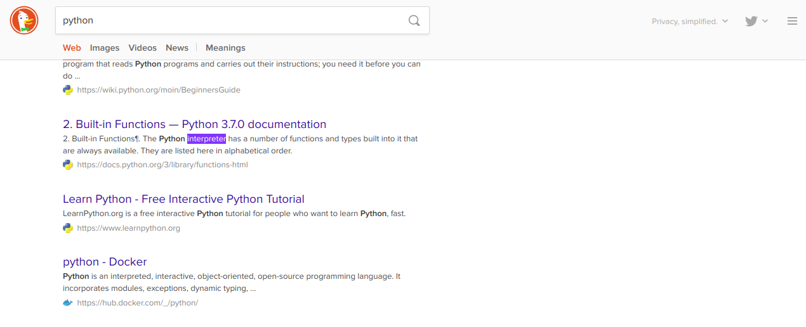
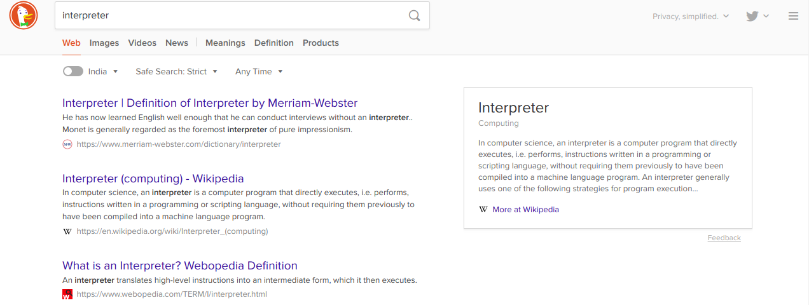

# LClip

LClip script helps you search clipboard data on your Ubuntu GNOME favourite browser.

## Features

* Open Source
* Makes search easier.
* Browser Google or Firefox or Chromium
* Search on google.com or duckduckgo.com

## Installation and Usage

1. [Python3](https://www.python.org/downloads/) required
2. Install lclip
```
pip3 install lclip
```
3. lclip setup
```
lclip -s
```
4. Not Implemented Error:
   
    "Pyperclip could not find a copy/paste mechanism for your system"
```
sudo apt-get install xsel
```
to install the xsel utility.

----
## How can it helps?
When using keyboard shortcut to run the script, it is lot easier to search any keyword or url that you read on book, website etc.

Example: 
Copy any keyword or url.
```
Ctrl + c
```
Run script with keyboard shortcut and search on browser's new tab.
```
Ctrl + Shift + x 
```

## Screenshot




## Suggestions
Open to any suggestions and help provided.
